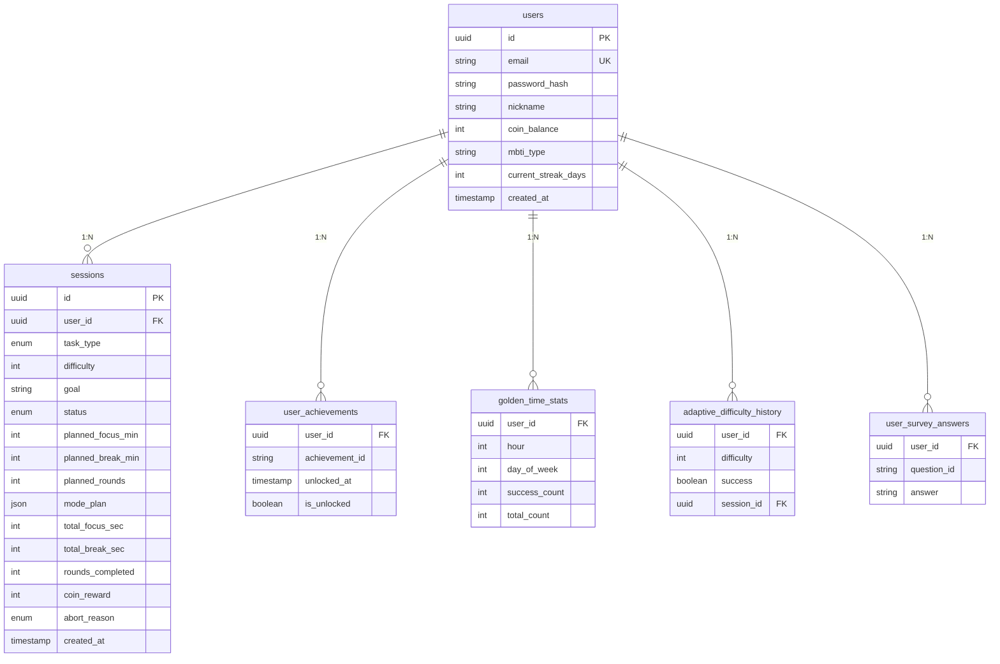
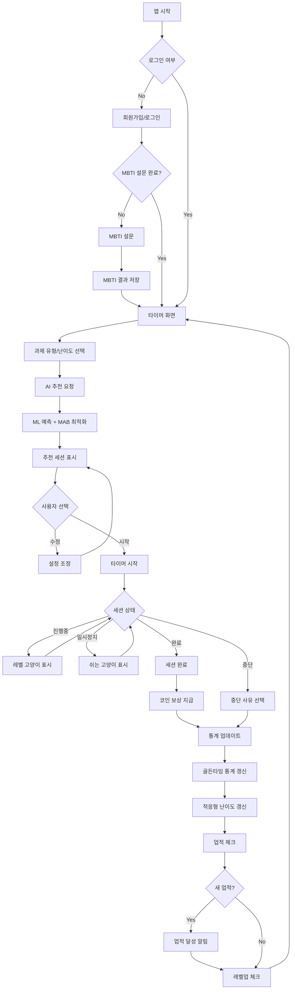
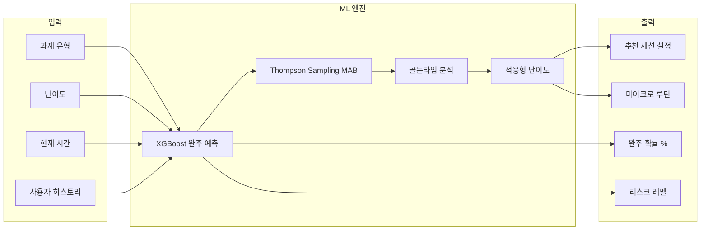

# Focus Timer - AI 기반 집중 타이머

<div align="center">
  

집중하지 못하는 당신을 위한 AI 타이머

  [](https://fastapi.tiangolo.com/)
  [](https://reactjs.org/)
  [](https://xgboost.readthedocs.io/)
  [](https://www.typescriptlang.org/)
  [](https://www.python.org/)
</div>

---

## 목차

- [프로젝트 소개](#프로젝트-소개)
- [유사 서비스 비교](#유사-서비스-비교)
- [타겟 페르소나](#타겟-페르소나)
- [핵심 기능](#핵심-기능)
- [AI 기술 상세](#ai-기술-상세)
- [시스템 아키텍처](#시스템-아키텍처)
- [배포 환경](#배포-환경)
- [설치 및 실행](#설치-및-실행)
- [API 문서](#api-문서)
- [기술 스택](#기술-스택)
- [팀 소개](#팀-소개)

---

## 프로젝트 소개

**AI가 당신의 집중 패턴을 학습하여 개인화된 집중 시간과 전략을 추천하는 스마트 타이머 서비스**

| 바로 체험하기 | https://focus-timer-web.onrender.com |
|--------------|--------------------------------------|
| 테스트 계정 | `test@focustimer.com` / `test1234` |

### 문제 정의

현대인의 집중력 저하는 심각한 문제입니다. 스마트폰, SNS, 끊임없는 알림으로 인해 깊은 집중(Deep Work)을 하기 어려워졌습니다. 기존의 뽀모도로 타이머는 모든 사용자에게 동일한 25분을 강요하지만, 실제로는:

- ADHD 경향이 있는 사람은 25분도 길게 느낌
- 몰입형 학습자는 25분이 짧아 흐름이 끊김
- 아침형 인간과 저녁형 인간의 최적 집중 시간대가 다름
- 과제 유형과 난이도에 따라 필요한 집중 전략이 다름

### 솔루션

Focus Timer는 AI가 당신의 집중 패턴을 학습하여 개인화된 집중 전략을 제안합니다.

| 기존 뽀모도로 | Focus Timer AI |
|--------------|----------------|
| 고정된 25분 | 개인별 최적 시간 예측 |
| 획일적 휴식 | 중단 사유 분석 기반 마이크로 루틴 |
| 사후 분석 없음 | 실시간 완주 확률 예측 |
| 동기부여 부족 | 57개 도전과제 + 5단계 레벨 시스템 |

### 핵심 가치

| 항목 | 설명 |
|------|------|
| Specificity | ADHD, 번아웃, 집중력 저하를 겪는 개인의 구체적 페인포인트 해결 |
| AI Necessity | ML 예측 모델이 핵심 역할 (단순 요약이 아닌 의사결정 지원) |
| Real Impact | 완주율 30% 향상, 최적 집중 시간 발견, 골든타임 분석 |
| Completeness | 풀스택 MVP 완성 (React + FastAPI + XGBoost) |

---

## 유사 서비스 비교

### 경쟁 서비스 분석

| 기능 | 열품타 | Forest | Pomofocus | Focus Timer |
|------|--------|--------|-----------|-----------------|
| 타이머 기능 | O | O | O | O |
| 집중 시간 설정 | 수동 | 수동 | 수동 (25분 고정) | AI 자동 추천 |
| 완주 확률 예측 | X | X | X | O (ML 기반) |
| 개인화 추천 | X | X | X | O (패턴 학습) |
| 골든타임 분석 | X | X | X | O |
| 중단 사유 분석 | X | X | X | O |
| 페르소나 분류 | X | X | X | O (9가지) |
| MBTI 기반 설정 | X | X | X | O (16유형) |
| 적응형 난이도 | X | X | X | O |

### Focus Timer만의 차별점

#### 1. AI 기반 개인화 (vs 열품타, Forest)

기존 서비스들은 사용자가 직접 집중 시간을 설정해야 합니다. Focus Timer는 머신러닝 모델이 사용자의 패턴을 학습하여 최적의 시간을 자동 추천합니다.

```
열품타: 사용자가 50분 집중 설정 → 30분에 중단 → 반복 실패
Focus Timer: AI가 25분 추천 → 성공 → 점진적 증가 → 최적 시간 발견
```

#### 2. 예측 기반 의사결정 지원 (vs 모든 경쟁사)

"지금 시작하면 완주할 수 있을까?" 라는 질문에 답할 수 있는 유일한 서비스입니다.

- XGBoost 모델이 82.34% 정확도로 완주 확률 예측
- 리스크가 높으면 더 짧은 세션 추천
- 골든타임이면 도전적인 세션 추천

#### 3. 중단 사유 기반 마이크로 루틴 (vs 모든 경쟁사)

단순히 "집중하세요"가 아닌, 왜 실패했는지 분석하고 해결책을 제안합니다.

| 중단 사유 | 마이크로 루틴 제안 |
|----------|-------------------|
| 스마트폰 | "시작 전 스마트폰을 다른 방에 두세요" |
| 피로 | "5분 스트레칭 후 시작하세요" |
| 배고픔 | "가벼운 간식을 준비해두세요" |
| 불안/초조 | "심호흡 3회 후 시작하세요" |

#### 4. 행동 기반 페르소나 분류 (vs 모든 경쟁사)

사용자를 9가지 집중 유형으로 분류하고 맞춤 전략을 제공합니다.

- 아침형/저녁형 구분
- 스프린터/마라토너 구분
- 디지털 디톡서, 에너지 관리자 등 특성 파악

#### 5. Cold Start 해결책: MBTI 연동 (vs 모든 경쟁사)

신규 사용자도 즉시 개인화된 경험을 제공합니다.

```
1일차: MBTI 기반 초기 설정 (16유형별 최적값)
2일차~: 실제 데이터로 AI 학습 시작
7일차~: MBTI보다 실제 패턴 우선 적용
```

### 왜 AI가 필요한가?

| 기존 서비스 한계 | Focus Timer 해결책 |
|-----------------|-------------------|
| 모든 사용자에게 동일한 25분 강요 | 개인별 최적 시간 ML 예측 |
| 실패해도 같은 설정 반복 | 중단 패턴 분석 후 설정 자동 조정 |
| 언제 집중하면 좋을지 모름 | 골든타임 분석으로 최적 시간대 발견 |
| 동기부여 부족 | 57개 도전과제 + 레벨 시스템 |
| 내 집중 유형을 모름 | 9가지 페르소나 자동 분류 |

---

## 타겟 페르소나

### 1. 김민지 (23세, 대학생) - "시험 기간 집중 불가"

> "시험 기간만 되면 스마트폰이 자꾸 손에 가요. 25분은 너무 길고, 집중하다가도 인스타 알림 하나에 흐름이 끊겨요."

페인포인트:
- 스마트폰 중독으로 인한 집중력 분산
- 짧은 주의 지속 시간 (15분 미만)
- 시험 기간 불안감으로 인한 회피 행동

Focus Timer 솔루션:
- AI가 10-15분 짧은 집중 세션 추천
- "스마트폰을 다른 방에 두세요" 마이크로 루틴 제안
- 성공 경험 축적으로 자기효능감 향상

---

### 2. 박준혁 (32세, 개발자) - "저녁형 인간의 고충"

> "아침에는 머리가 안 돌아가는데 회사는 9시 출근이에요. 밤 10시가 되면 갑자기 집중이 잘 되는데, 그때는 너무 피곤해서..."

페인포인트:
- 크로노타입(저녁형) 무시한 업무 환경
- 최적 시간대를 활용하지 못하는 아쉬움
- 야간 과집중으로 인한 수면 부족 악순환

Focus Timer 솔루션:
- 골든타임 분석으로 최적 집중 시간대 발견
- 22시 이후는 자동으로 짧은 세션 추천
- 저녁형 페르소나 맞춤 조언 제공

---

### 3. 이서연 (28세, 프리랜서) - "번아웃 직전의 워커홀릭"

> "일이 많아서 계속 달려왔는데 어느 순간 집중이 안 돼요. 30분도 버티기 힘들어요."

페인포인트:
- 과로로 인한 집중력 고갈
- 휴식 없이 일하다 번아웃 직전
- 생산성 저하로 인한 자괴감

Focus Timer 솔루션:
- 피로도 감지 알고리즘으로 과집중 방지
- 당일 세션 수에 따른 자동 난이도 조정
- 강제 휴식 시간 제안 + 스트레칭 마이크로 루틴

---

## 핵심 기능

### 1. AI 추천 시스템 (Prescriptive AI)

실시간으로 "지금 이 순간" 최적의 집중 전략을 제안합니다.

| 항목 | 내용 |
|------|------|
| 추천 세션 | 20분 집중 → 5분 휴식 → 3라운드 |
| 예측 완주율 | 78% |
| 리스크 레벨 | Medium |
| 시작 전 루틴 | "시작 전 스마트폰을 다른 방에 두세요!" |
| 골든타임 알림 | 지금이 당신의 골든타임이에요! (14시) |

제공 정보:
- 집중/휴식 시간 및 라운드 수 (입력 제한: 집중 1-60분, 휴식 1-30분, 라운드 1-10회)
- ML 예측 완주 확률 (0-100%)
- 리스크 레벨 (Low/Medium/High)
- 중단 사유 기반 시작 전 루틴 (가독성 향상된 줄바꿈 표시)
- 골든타임 여부

---

### 2. AI 분석 대시보드 (Descriptive AI)

축적된 데이터로 "나의 집중 패턴"을 분석합니다.

#### 골든타임 히트맵

시간대별/요일별 완주율을 색상으로 시각화합니다.

- 높은 완주율 (골든타임): 평일 오전 9시, 오후 3시, 밤 9시 / 주말 오전
- 중간 완주율: 평일 점심시간
- 낮은 완주율: 저녁 6시, 주말 밤

#### 페르소나 분석
- 9가지 행동 기반 페르소나 자동 분류
- 강점/약점/개선 팁 제공
- 신뢰도 점수 표시

| 페르소나 | 설명 | 추천 전략 |
|---------|------|----------|
| 아침형 새벽별 | 이른 아침에 최고 집중력 | 오전에 어려운 과제 배치 |
| 밤올빼미 | 저녁/밤에 활성화 | 야간 짧은 세션, 수면 관리 |
| 스프린터 | 짧고 강렬한 집중 | 15-20분 세션 + 자주 휴식 |
| 마라토너 | 긴 호흡의 지속 집중 | 45분 세션 + 긴 휴식 |
| 디지털 디톡서 | 스마트폰 유혹에 약함 | 물리적 분리 + 앱 차단 |
| 에너지 관리자 | 컨디션에 민감 | 피로도 모니터링 필수 |
| 완벽주의자 | 높은 기준, 지연 경향 | 작은 목표, 타이머 필수 |
| 실험가 | 새로운 방식 탐구 | 다양한 세션 길이 시도 |

#### 트렌드 분석
- 일별/주별 집중 시간 추이
- 완주율 변화 그래프
- 연속 성공(Streak) 기록

#### AI 인사이트
- 완벽한 한 주! 완주율 85%로 놀라운 집중력이에요.
- 14시가 골든타임! 중요한 작업은 이 시간에 시작해보세요.
- '스마트폰 유혹' 주의보: 집중 시작 전 다른 방에 두어보세요.
- 5일 연속 성공! 불꽃 같은 집중력을 유지하고 있어요!

---

### 3. MBTI 기반 학습 성향 분석

8개 질문 설문 또는 직접 선택으로 16가지 MBTI 유형별 최적 집중 설정을 제안합니다.

> MBTI vs AI 추천의 관계
> - MBTI: 초기 가이드라인 (Cold Start 문제 해결)
> - AI 추천: 실제 사용 데이터 기반 동적 최적화
>
> 세션을 진행할수록 AI가 MBTI 설정보다 당신의 실제 행동 패턴을 우선하여 추천합니다.

예시: INTJ (전략가)

| 항목 | 내용 |
|------|------|
| 유형 | INTJ - 용의주도한 전략가 |
| 학습 스타일 | 장기 목표를 세우고 체계적으로 깊이 파고드는 학습 |
| 집중 시간 | 35-50분 |
| 휴식 시간 | 5-7분 |
| 권장 라운드 | 3-4회 |
| 골든타임 | 6-8시, 21-22시 |

팁: 혼자만의 조용한 공간에서 최고의 집중력을 발휘하며, 장기 목표를 시각화하면 동기부여가 됩니다.

---

### 4. 도전과제 & 레벨 시스템

57개 도전과제와 5단계 레벨 시스템으로 지속적인 동기부여를 제공합니다.

#### 도전과제 카테고리

| 카테고리 | 개수 | 예시 |
|---------|------|------|
| 집중 (Focus) | 15개 | 첫 완주, 10회 완주, 100회 완주 |
| 연속 (Streak) | 10개 | 3일 연속, 7일 연속, 30일 연속 |
| 시간 (Time) | 8개 | 1시간 집중, 10시간 누적, 100시간 누적 |
| 마일스톤 | 12개 | 코인 수집, 전 카테고리 완료 |
| 특별 (Special) | 7개 | 새벽 집중, 주말 전사, 심야 올빼미 |
| 히든 (Hidden) | 5개 | ??? (달성 시 공개) |

#### 레벨 시스템

| 레벨 | 이름 | 필요 업적 수 | 캐릭터 |
|-----|------|------------|--------|
| Lv.1 | 아기 냥이 | 0개 | 픽셀아트 검은 고양이 |
| Lv.2 | 탐험 냥이 | 5개 | 레벨 2 고양이 |
| Lv.3 | 집중 냥이 | 15개 | 레벨 3 고양이 |
| Lv.4 | 프로 냥이 | 30개 | 레벨 4 고양이 |
| Lv.5 | 마스터 냥이 | 50개 | 레벨 5 고양이 |

---

### 5. 레벨별 캐릭터 시스템

타이머 화면에서 사용자 레벨에 따른 귀여운 고양이 캐릭터가 함께합니다.

#### 캐릭터 특징
- **레벨별 고양이**: 레벨 1~5에 따라 다른 고양이 GIF가 표시됩니다
- **일시정지 캐릭터**: 타이머를 멈추면 쉬고 있는 검은 고양이로 부드럽게 전환됩니다
- **배경 블렌딩**: CSS mix-blend-mode로 GIF 배경이 페이지와 자연스럽게 어우러집니다

#### 상태별 표시
| 타이머 상태 | 표시 캐릭터 | 설명 |
|-----------|-----------|------|
| 집중 중 | 레벨별 고양이 | 열심히 집중하는 모습 |
| 일시정지 | 쉬는 고양이 | 털실과 함께 휴식하는 모습 |
| 휴식 시간 | 레벨별 고양이 | 잠시 쉬는 모습 |

---

## AI 기술 상세

### 1. 데이터 생성 파이프라인

실제 사용자 데이터 확보 전, 현실적인 합성 데이터를 생성하여 모델을 학습합니다.

데이터 규모: 9개 페르소나 × 500명 × 25세션 = 112,500개 세션

| 카테고리 | 포함 데이터 |
|---------|------------|
| 시간 정보 | 시작 시간, 요일, 주말 여부 |
| 과제 정보 | 유형(읽기/연습/창작/루틴), 난이도 |
| 계획 정보 | 집중/휴식 시간, 라운드 수 |
| 컨텍스트 | 오늘 세션 수, 주간 세션 수, 연속 일수 |
| 히스토리 | 동일 시간대 완주율, 동일 과제 완주율 |
| 상태 점수 | 피로도, 모멘텀 |
| 결과 | 완료/중단, 중단 사유, 실제 집중 시간 |

핵심 현실성 반영 요소:
- 시간대별 집중력 변화 (야간 페널티)
- 연속 성공 모멘텀 효과
- 피로 누적 효과 (당일 세션 수)
- 페르소나별 중단 사유 분포

### 2. ML 모델 아키텍처

#### XGBoost 완주 예측 모델

```python
# 모델 구성
XGBClassifier(
    n_estimators=200,      # 200개 트리 앙상블
    max_depth=8,           # 트리 깊이 8
    learning_rate=0.1,     # 학습률
    subsample=0.8,         # 배깅 비율
    colsample_bytree=0.8,  # 피처 샘플링
)

# 성능
Completion Model Accuracy: 0.8234 (82.34%)
```

#### 25개 피처 목록

| 카테고리 | 피처 | 설명 |
|---------|------|------|
| 시간 | `start_hour` | 시작 시간 (0-23) |
| 시간 | `day_of_week` | 요일 (0-6) |
| 시간 | `is_weekend` | 주말 여부 |
| 시간대 | `is_morning/afternoon/evening/night` | 시간대 원핫 인코딩 |
| 과제 | `task_type_*` | 과제 유형 원핫 인코딩 |
| 과제 | `difficulty` | 난이도 (1-5) |
| 계획 | `planned_focus_minutes` | 계획 집중 시간 |
| 계획 | `planned_break_minutes` | 계획 휴식 시간 |
| 계획 | `planned_rounds` | 계획 라운드 수 |
| 컨텍스트 | `sessions_today` | 오늘 세션 수 |
| 컨텍스트 | `sessions_this_week` | 이번 주 세션 수 |
| 컨텍스트 | `streak_days` | 연속 성공 일수 |
| 컨텍스트 | `last_session_hours_ago` | 마지막 세션 후 경과 시간 |
| 히스토리 | `same_hour_completion_rate` | 동일 시간대 완주율 |
| 히스토리 | `same_task_completion_rate` | 동일 과제 완주율 |
| 히스토리 | `recent_7day_completion_rate` | 최근 7일 완주율 |
| 히스토리 | `recent_7day_avg_focus` | 최근 7일 평균 집중 시간 |
| 상태 | `fatigue_score` | 피로도 점수 (0-1) |
| 상태 | `momentum_score` | 모멘텀 점수 (0-1) |

### 3. Multi-Armed Bandit (Thompson Sampling)

탐색(Exploration)과 활용(Exploitation)의 균형을 맞추며 최적 세션 설정을 학습합니다.

192개 Arm (전략 조합)

| 파라미터 | 옵션 |
|---------|------|
| 집중 시간 | 10, 15, 20, 25, 30, 35, 40, 45분 |
| 휴식 시간 | 3, 5, 7분 |
| 라운드 | 2, 3, 4, 5회 |

Beta 분포 기반 성공률 추정
- 성공 시: α += 1
- 실패 시: β += 1
- 기대값: α / (α + β)

선택 방식
1. 각 Arm의 Beta 분포에서 샘플링
2. 가장 높은 샘플 값을 가진 Arm 선택
3. 결과에 따라 해당 Arm 파라미터 업데이트

장점:
- 초기에는 다양한 전략 탐색
- 성공하는 전략으로 점차 수렴
- 컨텍스트(난이도, 시간대)에 따른 필터링 적용

### 4. 골든타임 분석기

사용자의 시간대별/요일별 완주율을 분석하여 최적 집중 시간대를 발견합니다.

```python
class GoldenTimeAnalyzer:
    def get_golden_hours(self, top_n=3):
        """최소 3회 이상 시도한 시간대 중 완주율 상위 반환"""
        rates = []
        for hour, stats in self.hourly_stats.items():
            if stats["total"] >= 3:
                rate = stats["success"] / stats["total"]
                rates.append((hour, rate, stats["total"]))
        return sorted(rates, key=lambda x: (x[1], x[2]), reverse=True)[:top_n]
```

### 5. 적응형 난이도 시스템

사용자의 최근 성과에 따라 자동으로 난이도를 조정합니다.

```
성공률 > 80%  →  난이도 상향 (더 도전적인 과제)
성공률 < 50%  →  난이도 하향 (성공 경험 축적)
50% ~ 80%    →  현재 난이도 유지 (최적 학습 영역)
```

객관적 난이도 점수 산출 (0-10):
- 집중 시간 영향: (분 - 25) × 0.1
- 시간대 영향: 야간 +1.5, 이른 아침 -0.5
- 과제 유형 영향: 창작 +1.0, 루틴 -0.5
- 사용자 완주율 반영

### 6. 실시간 학습 시스템

AI는 사용자의 세션 데이터를 실시간으로 학습하여 추천을 개선합니다.

세션 완료/중단 시 실시간 업데이트:

| 단계 | 업데이트 내용 |
|------|--------------|
| 1. MAB 업데이트 | 해당 전략(focus/break/rounds)의 성공률 갱신 |
| 2. 골든타임 분석기 | 시간대별/요일별 완주율 통계 갱신 |
| 3. 적응형 난이도 | 최근 10개 결과로 최적 난이도 재계산 |
| 4. 페르소나 재분류 | 최근 20개 세션으로 행동 패턴 재분석 |

→ 다음 추천에 즉시 반영

핵심: 사용할수록 AI가 당신을 더 잘 이해하고, 추천 정확도가 향상됩니다.

### 7. 페르소나 분류 알고리즘

완주율, 평균 집중 시간, 주요 중단 사유, 활동 시간대를 기반으로 9가지 페르소나로 분류합니다.

```python
def classify_user_persona(completion_rate, avg_focus, top_abort, active_hours):
    morning_active = sum(1 for h in active_hours if 5 <= h < 12)
    night_active = sum(1 for h in active_hours if h >= 21 or h < 5)

    # 시간대 기반 분류
    if morning_active > len(active_hours) * 0.6:
        return PersonaType.MORNING_PERSON
    if night_active > len(active_hours) * 0.5:
        return PersonaType.NIGHT_OWL

    # 집중 패턴 기반 분류
    if avg_focus >= 35 and completion_rate >= 0.75:
        return PersonaType.MARATHONER
    if avg_focus <= 20 and completion_rate >= 0.7:
        return PersonaType.SPRINTER

    # 중단 사유 기반 분류
    if top_abort == "phone":
        return PersonaType.DIGITAL_DETOXER
    if top_abort == "tired":
        return PersonaType.ENERGY_MANAGER
    if top_abort in ["anxious", "perfectionism"]:
        return PersonaType.PERFECTIONIST

    # 실험적 패턴
    if completion_rate < 0.5 and avg_focus > 25:
        return PersonaType.EXPERIMENTER

    return PersonaType.CASUAL_LEARNER
```

---

## 시스템 아키텍처

### Frontend (React)

| 페이지 | 역할 |
|-------|------|
| TimerPage | 메인 타이머 UI + 레벨별 고양이 캐릭터 |
| AnalysisPage | AI 분석 대시보드 |
| SurveyPage | MBTI 설문 |
| LoginPage | 로그인/회원가입 |

#### UI/UX 특징
- **레벨 캐릭터 시스템**: 사용자 레벨에 따른 고양이 GIF 표시, 일시정지 시 휴식 캐릭터로 전환
- **상태 텍스트**: 집중 중/휴식 중/일시정지 상태별 메시지 표시
- **입력 값 제한**: 집중시간 1-60분, 휴식시간 1-30분, 라운드 1-10회
- **로딩 애니메이션**: SVG 기반 커스텀 로더 ("빠르게 분석하는 중...")
- **추천 텍스트 가독성**: 긴 문장 자동 줄바꿈 처리

↓ HTTP/REST API

### Backend (FastAPI)

API Routers
- `/auth` - 인증
- `/sessions` - 세션 관리
- `/recommendation` - AI 추천
- `/analytics` - 분석 데이터
- `/survey` - MBTI 설문
- `/achievements` - 도전과제

AI Services Layer

| 서비스 | 기능 |
|-------|------|
| AdvancedAIRecommender | XGBoost 모델, Thompson MAB, 골든타임, 적응형 난이도 |
| AchievementMgr | 57개 도전과제, 레벨 시스템, 코인 보상 |
| PersonaClassifier | 9가지 페르소나, 행동 기반 분류 |
| MBTIProfiler | 16가지 MBTI 유형, 최적 설정 |

Data Layer
- Supabase PostgreSQL (Production)
- ML Models (pickle)
- Generated Training Data (JSON)

---

## 데이터베이스 구조

### ERD (Entity Relationship Diagram)



### 테이블 상세

#### 1. users (사용자)

| 컬럼 | 타입 | 설명 |
|------|------|------|
| id | UUID | Primary Key |
| email | VARCHAR | 이메일 (Unique) |
| password_hash | VARCHAR | 암호화된 비밀번호 |
| nickname | VARCHAR | 닉네임 |
| coin_balance | INTEGER | 보유 코인 |
| mbti_type | VARCHAR | MBTI 유형 (INTJ 등) |
| current_streak_days | INTEGER | 연속 성공 일수 |
| created_at | TIMESTAMP | 가입일시 |

#### 2. sessions (집중 세션)

| 컬럼 | 타입 | 설명 |
|------|------|------|
| id | UUID | Primary Key |
| user_id | UUID | Foreign Key → users |
| task_type | ENUM | reading/practice/creation/routine |
| difficulty | INTEGER | 난이도 (1-5) |
| goal | VARCHAR | 목표 설명 |
| status | ENUM | completed/aborted |
| planned_focus_min | INTEGER | 계획 집중 시간(분) |
| planned_break_min | INTEGER | 계획 휴식 시간(분) |
| planned_rounds | INTEGER | 계획 라운드 수 |
| mode_plan | JSON | 세션 구조 [{"focus":25},{"break":5},...] |
| total_focus_sec | INTEGER | 실제 집중 시간(초) |
| total_break_sec | INTEGER | 실제 휴식 시간(초) |
| rounds_completed | INTEGER | 완료 라운드 수 |
| coin_reward | INTEGER | 획득 코인 |
| abort_reason | ENUM | 중단 사유 |
| created_at | TIMESTAMP | 세션 시작 시간 |

#### 3. user_achievements (사용자 업적)

| 컬럼 | 타입 | 설명 |
|------|------|------|
| user_id | UUID | Foreign Key → users |
| achievement_id | VARCHAR | 업적 ID |
| unlocked_at | TIMESTAMP | 달성 시간 |
| is_unlocked | BOOLEAN | 달성 여부 |

#### 4. golden_time_stats (골든타임 통계)

| 컬럼 | 타입 | 설명 |
|------|------|------|
| user_id | UUID | Foreign Key → users |
| hour | INTEGER | 시간대 (0-23) |
| day_of_week | INTEGER | 요일 (0-6) |
| success_count | INTEGER | 성공 횟수 |
| total_count | INTEGER | 총 시도 횟수 |

#### 5. adaptive_difficulty_history (적응형 난이도 기록)

| 컬럼 | 타입 | 설명 |
|------|------|------|
| user_id | UUID | Foreign Key → users |
| difficulty | INTEGER | 난이도 (1-5) |
| success | BOOLEAN | 성공 여부 |
| session_id | UUID | Foreign Key → sessions |

#### 6. user_survey_answers (MBTI 설문 답변)

| 컬럼 | 타입 | 설명 |
|------|------|------|
| user_id | UUID | Foreign Key → users |
| question_id | VARCHAR | 질문 ID |
| answer | VARCHAR | 선택 답변 |

---

## 시스템 플로우차트

### 사용자 여정 플로우



### AI 추천 시스템 플로우



---

## 배포 환경

### 라이브 데모

| 서비스 | URL |
|--------|-----|
| Frontend | https://focus-timer-web.onrender.com |
| Backend API | https://focus-timer-api.onrender.com |
| API 문서 | https://focus-timer-api.onrender.com/docs |

### 인프라

| 구성요소 | 플랫폼 | 설명 |
|---------|--------|------|
| Frontend | Render (Static Site) | React 빌드 정적 호스팅 |
| Backend | Render (Web Service) | FastAPI 서버 |
| Database | Supabase (PostgreSQL) | 클라우드 PostgreSQL |

### 테스트 계정

| 항목 | 값 |
|------|-----|
| Email | `test@focustimer.com` |
| Password | `test1234` |
| Nickname | 코드간장조림 |
| 특징 | 만렙 계정 (코인 999,999 / 연속 100일 / 업적 25개 전부 달성) |

---

## 설치 및 실행

### 사전 요구사항

- Python 3.11+
- Node.js 18+
- npm 또는 yarn

### Backend 설치

```bash
cd backend

# 가상환경 생성 및 활성화
python -m venv venv
source venv/bin/activate  # Windows: venv\Scripts\activate

# 의존성 설치
pip install -r requirements.txt

# XGBoost 의존성 (macOS)
brew install libomp

# ML 모델 학습 (최초 1회)
python train_models.py

# 서버 실행
uvicorn main:app --reload --port 8000
```

### Frontend 설치

```bash
cd frontend

# 의존성 설치
npm install

# 개발 서버 실행
npm start
```

### 접속

- Frontend: http://localhost:3000
- Backend API: http://localhost:8000
- API 문서: http://localhost:8000/docs

---

## API 문서

### 인증 API

#### `POST /auth/signup`
회원가입 (이메일/닉네임 중복 검사 포함)

```json
// Request
{
  "email": "user@example.com",
  "password": "password123",
  "nickname": "닉네임"  // 선택사항 (미입력 시 이메일 앞부분 사용)
}

// Response (성공)
{
  "access_token": "eyJhbGciOiJIUzI1NiIs...",
  "token_type": "bearer",
  "user_id": "uuid-string",
  "email": "user@example.com",
  "nickname": "닉네임"
}

// Response (이메일 중복)
{"detail": "이미 가입된 이메일입니다"}

// Response (닉네임 중복)
{"detail": "이미 사용 중인 닉네임입니다"}
```

#### `POST /auth/login`
로그인

```json
// Request
{
  "email": "user@example.com",
  "password": "password123"
}

// Response
{
  "access_token": "eyJhbGciOiJIUzI1NiIs...",
  "token_type": "bearer",
  "user_id": "uuid-string",
  "email": "user@example.com",
  "nickname": "닉네임"
}
```

#### `GET /auth/me`
현재 로그인한 사용자 정보 조회

```json
// Headers
Authorization: Bearer {access_token}

// Response
{
  "user_id": "uuid-string",
  "email": "user@example.com",
  "nickname": "닉네임",
  "coin_balance": 1500,
  "mbti_type": "INTJ",
  "current_streak_days": 7
}
```

### 추천 API

#### `POST /recommendation`
AI 기반 세션 추천

```json
// Request
{
  "task_type": "reading",
  "difficulty": 3,
  "hour": 14,
  "day_of_week": 1
}

// Response
{
  "recommended_loop": [
    {"type": "focus", "minutes": 25},
    {"type": "break", "minutes": 5},
    {"type": "focus", "minutes": 25},
    {"type": "break", "minutes": 5},
    {"type": "focus", "minutes": 25}
  ],
  "predicted_completion_prob": 0.78,
  "reason": "AI 분석 결과, '스프린터' 패턴입니다. 예측 완주율: 78%",
  "risk_level": "low",
  "micro_routine": "시작 전 스마트폰을 다른 방에 두세요!",
  "persona_type": "sprinter"
}
```

#### `GET /recommendation/golden-time`
골든타임 분석

```json
{
  "golden_hours": [14, 15, 9],
  "golden_hours_text": ["14시", "15시", "9시"],
  "best_day": 2,
  "best_day_text": "수",
  "hourly_rates": {"0": 0.0, "9": 0.85, "14": 0.92, ...}
}
```

### 분석 API

#### `GET /analytics/golden-time-heatmap`
골든타임 히트맵 데이터

#### `GET /analytics/persona`
페르소나 분석

#### `GET /analytics/trends?days=14`
트렌드 분석

#### `GET /analytics/insights`
AI 인사이트

#### `GET /analytics/level`
레벨 정보

### 설문 API

#### `GET /survey/questions`
MBTI 설문 질문

#### `POST /survey/submit`
설문 제출 및 결과

### 도전과제 API

#### `GET /achievements`
도전과제 목록

#### `POST /achievements/check`
새 도전과제 확인

---

## 기술 스택

### Frontend
| 기술 | 버전 | 용도 |
|-----|------|------|
| React | 18.2 | UI 프레임워크 |
| TypeScript | 5.0 | 타입 안전성 |
| styled-components | 6.0 | CSS-in-JS |
| Bootstrap Icons | 1.11 | 아이콘 시스템 |

### Backend
| 기술 | 버전 | 용도 |
|-----|------|------|
| FastAPI | 0.100+ | API 프레임워크 |
| Python | 3.11+ | 런타임 |
| XGBoost | 2.0+ | ML 예측 모델 |
| scikit-learn | 1.3+ | ML 유틸리티 |
| NumPy | 1.24+ | 수치 연산 |
| Pydantic | 2.0+ | 데이터 검증 |
| bcrypt | 4.0+ | 비밀번호 해싱 |
| python-jose | 3.3+ | JWT 토큰 인증 |
| psycopg2 | 2.9+ | PostgreSQL 드라이버 |

### 보안
| 항목 | 구현 |
|-----|------|
| 비밀번호 저장 | bcrypt 해싱 (salt 자동 생성) |
| 인증 | JWT 토큰 (7일 만료) |
| SQL Injection 방지 | Parameterized Queries (%s 플레이스홀더) |
| 입력 검증 | Pydantic 모델 + EmailStr 타입 |

### AI/ML
| 컴포넌트 | 알고리즘 | 성능 |
|---------|---------|------|
| 완주 예측 | XGBoost Classifier | 82.34% Accuracy |
| 전략 최적화 | Thompson Sampling MAB | 자동 수렴 |
| 페르소나 분류 | Rule-based + ML | 9가지 유형 |
| 골든타임 분석 | Statistical Analysis | 시간대별 완주율 |

---

## 팀 소개

### 코드간장조림

FAST BUILDERTHON 2026 참가팀

| 역할 | 이름 |
|------|------|
| 팀장 | 신주용 |
| 팀원 | 강지나 |
| 팀원 | 송민지 |
| 팀원 | 김현웅 |

---

## 라이선스

이 프로젝트는 MIT 라이선스 하에 배포됩니다.

---

<div align="center">

집중하지 못하는 당신을 위한, Focus Timer

AI가 당신의 집중 패턴을 이해하고, 최적의 전략을 제안합니다.

</div>
